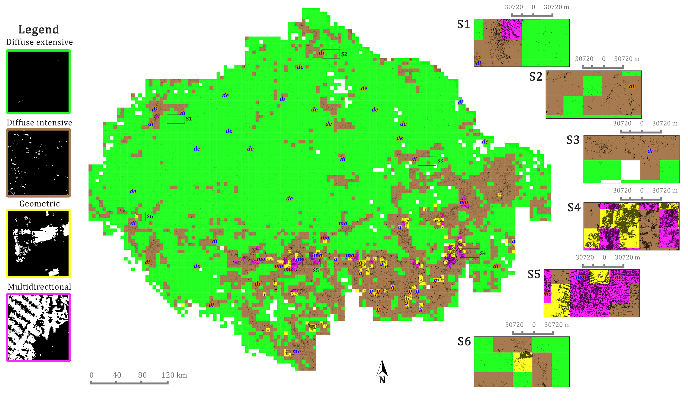
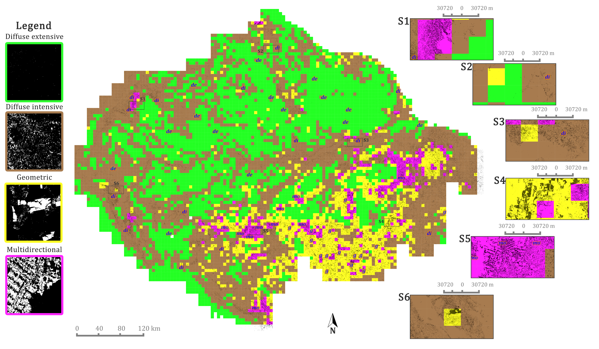

# postloss-Spattern: A data mining based tool for mapping spatial patterns of tree cover loss

Data mining based tool for mapping spatial patterns of tree cover loss according to Terra-i and Global Forest Change (GFC) datasets .

If you use this repository consider citing:

The tool can be executed using the demo data (inside the repository folder).

## Documentation
A detailed step by step guide is under preparation. Meanwhile, theory and hands-on slides are provided inside the repository folder.

## Related links
* [Blog post](http://www.terra-i.org/news/news/How-can-the-shapes-and-distribution-of-deforested-areas-inform-us-about-the-agents-of-changes-on-the-ground-.html)
* [Thesis](http://www.terra-i.org/terra-i/publications.html) (go to the section "External studies")

## Acknowledgements
The author acknowledges Dr. Mark Mulligan (first supervisor at King's College London) and Dr. Louis Reymondin (second supervisor at the International Center for Tropical Agriculture - CIAT) for their revision and feedback of this proof-of-concept scientific output.

## Contributing
Contributions via pull requests are welcome. Please make sure that changes pass the unit tests. Any bugs and problems can be reported on the repo's issues page.

## Future work
- Porting the scripts in R to Python
- Try state-of-art Deep Learning based techniques suited to map spatial patterns (i.e object detection)
- Augmentation of the training dataset via active learning (pe. using the ActiveLearner function from [modAL](https://modal-python.readthedocs.io/en/latest/content/models/ActiveLearner.html))

## Results of the best models suited to the Amazon region as defined by [RAISG](https//amazoniasocioambiental.org/en/about) 
### Using Terra-i data

### Using GFC data

